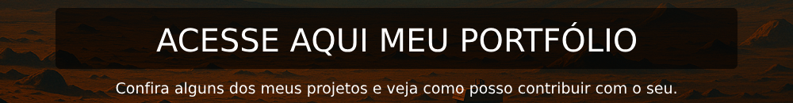

  
  
  
  
  
  
  
  
  

  

  

  

  

  

 

### 🏆 GitHub Profile Trophy

  

  

 

  <a href="https://github.com/luannsr12/">
  
  

  

  

  <em>Em caso de dúvida, meu caro amigo, sempre siga seu nariz</em>

